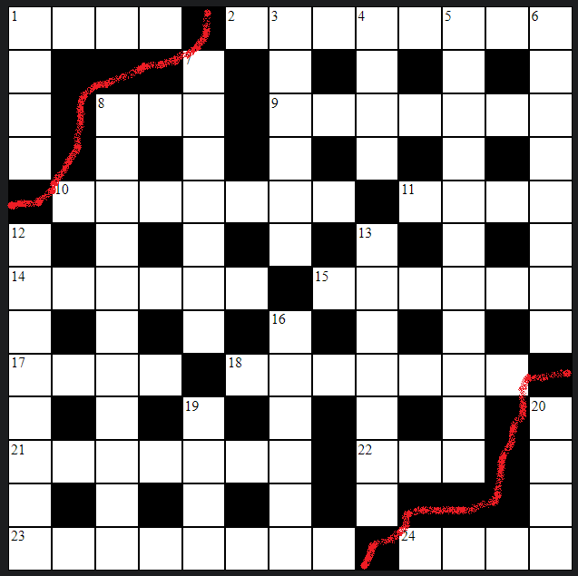

## Add issues you encounter with their resolutions here

## Invalid Grid State
- one of the reasons a crossword grid can be invalid is when the voids on the grid create islands of clues, or groups of clues that are not connected to other groups of clues.
- this happens when void cells are contiguous to other voids (including diagonally) in a line that stretches from one edge of the crossword to another (or the same edge).
- exmaple image:




- here you can see that the clues 1 Across, 1 Down, 24 Across, and 20 Down are not connected to the rest of the clues
- to highlight an invalid grid state to the user, it is necessary to identify this pattern of voids
- for each void that has contigous voids, I create an array and push the index of these voids into it 
- for example, the void to the right of 1 Across in the image above has an index of 4, and it has 2 other voids that it touches with index 16 and 18. We end up with an array of `[4, 16, 18]`
- repeat this for all voids and we end up with a big array of arrays
- the next challenge was I wanted to combine all of these arrays if they had any shared elements (i.e. they were touching)
- I tried to create this code myself, but it became an utter mess and wasn't working
- reluctantly, I turned to ChatGPT which gave me this:

```js
function mergeSubarrays(arrays) {
    function mergeTwoArrays(arr1, arr2) {
        return [...new Set([...arr1, ...arr2])];
    }

    function hasCommonElements(arr1, arr2) {
        return arr1.some(item => arr2.includes(item));
    }

    // This array will store the result
    let result = [];

    while (arrays.length > 0) {
        let first = arrays[0];
        let rest = arrays.slice(1);

        let lf = -1;
        while (lf !== first.length) {
            lf = first.length;
            let rest2 = [];
            for (let a of rest) {
                if (hasCommonElements(first, a)) {
                    first = mergeTwoArrays(first, a);
                } else {
                    rest2.push(a);
                }
            }
            rest = rest2;
        }

        result.push(first);
        arrays = rest;
    }

    return result;
}

// Example usage
const arrays = [
    [1, 2, 3],
    [3, 4, 5],
    [6, 7],
    [5, 6],
    [8, 9]
];

const mergedArrays = mergeSubarrays(arrays);
console.log(mergedArrays);

```
- and the explanation:

Explanation:
- mergeTwoArrays: Merges two arrays into one, removing duplicates by converting the concatenated arrays into a Set and back to an array.

- hasCommonElements: Checks if two arrays have any common elements using the some method.

- While Loop: Continuously processes and merges arrays until no more arrays are left to process:

- first, rest: Extract the first subarray and the rest of the subarrays.

- lf, first.length: Track the length of first to ensure it changes when elements are merged.

- rest2: Temporarily stores subarrays that don’t share elements with first.

- result.push(first): After processing, adds the merged subarray to the result.

- arrays = rest: Updates the arrays to process with the remaining subarrays.

This JavaScript implementation follows the same logic as the Python function, ensuring that all subarrays sharing common elements are merged into one, with duplicates removed.

- this works but isn't very intuitive, and so I spent some time going through it and adding comments for myself

- I asked ChatGPT if this pattern had a name:

The pattern you're describing is commonly associated with a "Union-Find" or "Disjoint-Set" data structure, often used for managing and merging disjoint sets. However, the specific approach of repeatedly merging overlapping subarrays can also be considered an application of a "Connected Components" algorithm in the context of graph theory, where each subarray represents a node and shared elements represent edges between nodes.

### Key Concepts:

1. **Union-Find / Disjoint-Set**:
   - This is a data structure that keeps track of elements partitioned into a number of disjoint (non-overlapping) subsets.
   - It provides efficient methods to unite (merge) sets and find representatives of sets.

2. **Connected Components**:
   - In graph theory, a connected component is a subgraph in which any two vertices are connected to each other by paths, and which is connected to no additional vertices in the supergraph.
   - The problem of merging subarrays with common elements is analogous to finding connected components in a graph.

While your specific implementation does not directly use the traditional union-find data structure, it embodies the idea of merging connected components.

### Example Implementation with Union-Find in JavaScript:

Here is how you might implement the same merging logic using a union-find approach:

```javascript
class UnionFind {
    constructor() {
        this.parent = {};
    }

    find(x) {
        if (this.parent[x] === undefined) {
            this.parent[x] = x;
        }
        if (this.parent[x] !== x) {
            this.parent[x] = this.find(this.parent[x]);
        }
        return this.parent[x];
    }

    union(x, y) {
        const rootX = this.find(x);
        const rootY = this.find(y);
        if (rootX !== rootY) {
            this.parent[rootY] = rootX;
        }
    }
}

function mergeSubarrays(arrays) {
    const uf = new UnionFind();

    // Step 1: Union all elements in each subarray
    for (let arr of arrays) {
        for (let i = 1; i < arr.length; i++) {
            uf.union(arr[0], arr[i]);
        }
    }

    // Step 2: Collect all elements by their root parent
    const components = {};
    for (let arr of arrays) {
        for (let num of arr) {
            const root = uf.find(num);
            if (!components[root]) {
                components[root] = new Set();
            }
            components[root].add(num);
        }
    }

    // Step 3: Convert sets to arrays
    const result = [];
    for (let key in components) {
        result.push(Array.from(components[key]));
    }

    return result;
}

// Example usage
const arrays = [
    [1, 2, 3],
    [3, 4, 5],
    [6, 7],
    [5, 6],
    [8, 9]
];

const mergedArrays = mergeSubarrays(arrays);
console.log(mergedArrays);
```

### Explanation:
1. **Union-Find Class**:
   - `find`: Finds the root representative of an element.
   - `union`: Merges two sets by connecting their root representatives.

2. **mergeSubarrays Function**:
   - **Step 1**: Union all elements within each subarray to ensure they are in the same set.
   - **Step 2**: Collect elements by their root parent to group connected components.
   - **Step 3**: Convert the sets of connected components back to arrays for the final result.

This approach leverages the efficiency of the union-find data structure for merging and finding connected components, making it suitable for problems involving merging overlapping sets or groups.

- then I asked if there was a more intuitive way to write the function and got this:

Certainly! Here is a more intuitive version of the JavaScript code that merges overlapping subarrays. This version uses plain arrays and objects for easier understanding and avoids the complexity of the union-find data structure.

```javascript
function mergeSubarrays(arrays) {
    function mergeTwoArrays(arr1, arr2) {
        return [...new Set([...arr1, ...arr2])];
    }

    function hasCommonElements(arr1, arr2) {
        return arr1.some(item => arr2.includes(item));
    }

    // Initialize the result array
    let result = [];

    while (arrays.length > 0) {
        // Take the first subarray
        let first = arrays[0];
        // Remaining subarrays
        let rest = arrays.slice(1);

        // Flag to check if we have merged any array
        let merged = false;

        for (let i = 0; i < rest.length; i++) {
            if (hasCommonElements(first, rest[i])) {
                // Merge arrays with common elements
                first = mergeTwoArrays(first, rest[i]);
                // Remove the merged array from rest
                rest.splice(i, 1);
                // Set the merged flag to true
                merged = true;
                // Restart the loop to check for further merges
                i = -1;
            }
        }

        // Add the merged or standalone array to result
        result.push(first);
        // Update arrays to the remaining arrays
        arrays = rest;
    }

    return result;
}

// Example usage
const arrays = [
    [1, 2, 3],
    [3, 4, 5],
    [6, 7],
    [5, 6],
    [8, 9]
];

const mergedArrays = mergeSubarrays(arrays);
console.log(mergedArrays);
```

### Explanation:
1. **mergeTwoArrays**: Merges two arrays into one, removing duplicates by converting the concatenated arrays into a `Set` and back to an array.
2. **hasCommonElements**: Checks if two arrays have any common elements using the `some` method.
3. **While Loop**: Continuously processes and merges arrays until no more arrays are left to process:
   - **first**: The first subarray to be processed.
   - **rest**: The remaining subarrays.
   - **merged**: A flag to check if any subarrays were merged in the current iteration.
   - **For Loop**: Iterates over the `rest` array to find and merge subarrays that share elements with `first`.
   - **splice**: Removes the merged subarray from `rest` and restarts the loop to check for further merges.
   - **result.push(first)**: Adds the merged or standalone subarray to the result.
   - **arrays = rest**: Updates the arrays to process with the remaining subarrays.

This version is simpler and more intuitive as it avoids the complexities of the union-find data structure, making it easier to understand and follow the merging process.

---
- the second function is way easier for my brain to comprehend and it makes sense that we reset the for loop everytime we match
